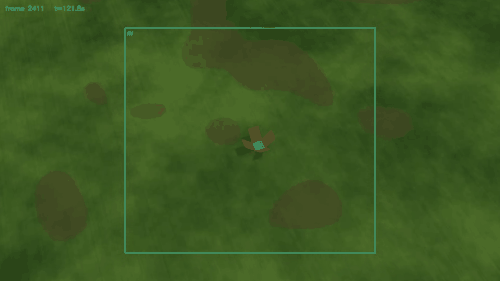
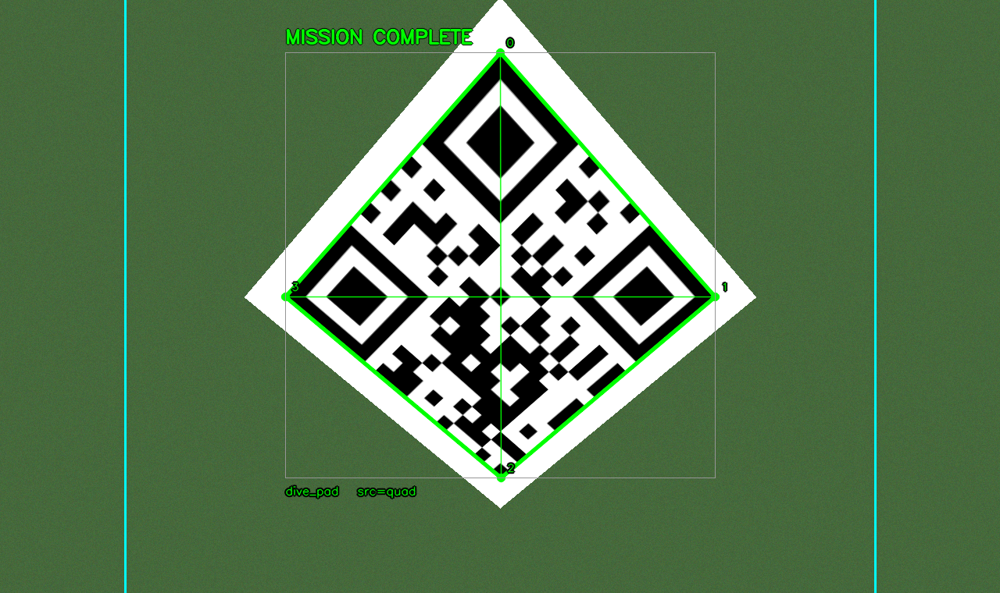

# qr-dive-guidance

Sabit kanat bir İHA'yı, yerdeki 2×2 m'lik bir QR hedefine otonom olarak
dalıp kodu okuyacak ve güvenle çıkacak şekilde yöneten uçuş görev yazılımı —
ve onu doğrulayan PX4 + Gazebo simülasyon ortamı.

*English documentation: **[README.md](README.md)***



*Gerçek simülasyon uçuşu, kurgu yok. Hedef kadraja giriyor, uçak yaklaştıkça
merkeze doğru kayıyor ve okunuyor — 8 okunabilir kare, 7'si tamamen Hedef
Vuruş Alanı'nın içinde. Animasyon o yedincide bir an duruyor: 32 m/s'de
okunabilir pencerenin tamamı yarım saniye kadar sürüyor.*

---

**TEKNOFEST 2026 Savaşan İHA yarışmasının Kamikaze görevi için geliştirildi.**

Yarışmaya katılacak takımlar için not: aşağıdaki her sayı ölçümle bulundu ve
şartname maddeleriyle birlikte belgelendi. Özellikle **dalış tetik mesafesi
türetmesi** (`108 m` bölümü) ve **decode eşiği tablosu** doğrudan işinize
yarayabilir — ikisi de bizim baştan yanlış yaptığımız ve ölçerek düzelttiğimiz
şeyler.

Şartname atıfları V1.3 / 11.04.2026 sürümüne göredir.

> **Bu deponun ayırt edici yanı ölçüm.** Her karar bir sayıya dayanıyor ve o
> sayının nereden geldiği kodun içinde yazılı. Aşağıdaki hataların çoğu
> *sessizdi*: program çalışıyor, hata vermiyor, görev başarısız oluyordu.

---

## Mimari

Üç bağımsız süreç, aralarında kuyruklarla haberleşiyor:

| Süreç | Dosya | İşi |
|---|---|---|
| **Communication** | `processes/ground_communication.py` | Yer istasyonuyla WebSocket; komut alır, durum yayınlar |
| **Perception** | `processes/perception.py` | Kamera karesinden QR tespiti, 4 köşe çıkarımı, AV içi/dışı kararı |
| **Mission Controller** | `processes/mission_controller.py` | 20 Hz'de koşan sonlu durum makinesi (FSM) |

Görev zinciri:

```
IDLE ──(komut: takeoff)──► TAKEOFF ──otomatik──► HOLD ──(komut: align)──► LOITER_ALIGN
                                                                              │
                                                                          otomatik
                                                                              ▼
        HOLD ◄──otomatik── PULL_UP ◄──otomatik── DIVE ◄──otomatik── APPROACH
```

Dışarıdan yalnızca iki komut gerekiyor (`takeoff`, `align`); gerisi otonom.

---

## Dalış geometrisi — işin özü

Kamera burunda ve **gövde ekseniyle paralel** (şartname s.10 böyle istiyor).
Yani aşağı değil, **burnun baktığı yere** bakıyor. Bu tek kısıt her şeyi
belirliyor.

**QR'ın dört tarafı 45° eğimli, 3 m plakalarla çevrili** — düz uçuşta
okunmasın diye. QR'ın *tamamını* görmek için en az 45° dik açıyla bakmak
gerekiyor. 55° dalış seçildi (plaka sınırına 10° pay).

### Dalış tetik mesafesi neden 108 m

İlk türetme `120 / tan(55°) = 84 m` idi ve **yanlıştı**. İki sebepten:

1. **Komut edilen pitch, gerçekleşen yol açısı değildir.** Sabit kanatta
   kanat taşıma üretmeye devam eder; uçak burnunun gösterdiğinden daha yatık
   bir yol izler. Uçuş kaydından geri çözüldü: 120 m'den 40 m'ye inerken
   80 m düşüp **80.1 m yatay yol** alınmış → gerçekleşen yol açısı **45°**.
2. Formül uçağın hedefe **vardığı** anı hesaplıyordu. Oysa hedefin, uçak
   decode irtifasındayken kameranın **önünde** olması gerekiyor.

Doğru türetme iki parçalı:

```
d_bore = decode_irtifası / tan(pitch)             = 40 / tan(55°) = 28.0 m
d_dive = (giriş − decode) / tan(gerçek_yol_açısı) = 80 / tan(45°) = 80.1 m
TETİK  = 108.0 m
```

Sonuç — hedef dalış boyunca **kesintisiz kadrajda**:

| İrtifa | Kalan yatay | Görüş hattı | Kadrajda |
|---|---|---|---|
| 120 m | 108.0 m | 48.0° | ✅ |
| 80 m | 68.0 m | 49.6° | ✅ |
| **40 m** | **28.0 m** | **55.0°** | ✅ tam merkez |
| 30 m | 18.0 m | 59.0° | ✅ |

Yanlış tetikle uçak 40 m'de hedefe 3.9 m kala varıyordu; kamera ise
önündeki 17.2–54.0 m'yi gördüğü için hedef kadrajın altında kalıyordu.
**4879 karede 0 tespit.** Düzeltmeden sonra QR ilk kez okundu.

---

## QR'ın dört köşesi



`pyzbar` bir QR bulduğunda iki şey döndürür: `rect` (eksen hizalı
sınırlayıcı kutu) ve `polygon` (gerçek dört köşe). Taban kod `polygon`'u
atıyordu. Yukarıdaki görselde ince gri dikdörtgen eski çizim, yeşil dörtgen
gerçek hedef sınırı.

Eğik bakışta QR karede kare değil, **eğik bir dörtgen** görünür. Kutuya
sıkıştırmanın maliyeti ölçüldü:

| | Kutunun şişmesi |
|---|---|
| Tam karşıdan | 1.00× |
| Perspektif | 1.02× |
| 15° dönme | 1.50× |
| **45° dönme** | **2.00×** |

Şişmeyi yapan **dönme**, perspektif değil.

> **Bir iddia ölçüldü ve yanlış çıktı.** "Kutu QR'dan 2 kat büyük olduğu için
> geçerli bir vuruş *AV dışında* sanılabilir" denmişti. Yanlış: Hedef Vuruş
> Alanı **eksen hizalı bir dikdörtgen**, ve bir dörtgenin böyle bir
> dikdörtgenin içinde olması ⟺ dört köşesinin de içinde olması ⟺ köşelerin
> min/max'ının içinde olması — ki o da **kutunun kendisi**. İki test özdeş.
> 41 konum/açı denendi, **sıfır ayrışma**.
>
> Dört köşenin gerçek değeri başka yerde: **perspektif-doğru merkez**
> (köşegen kesişimi, kutu ortası değil), **`solvePnP` ile menzil/poz**, ve HUD.

Merkez farkı da ölçüldü: perspektifsiz 0.0 px · gerçekçi dalış **2.8 px** ·
agresif açı 9.2 px. 2.8 px = 0.075° = 30 m'den yerde 4 cm.

---

## Ölçümler

**QR decode eşiği** (gz render'ı + gerçek algı kodu, V1 doku, 55° bakış,
51.28° HFOV, 1920×1080). Tek komutla yeniden üretilir:

```bash
bash sim/tools/measure_alt.sh
```

| İrtifa | Eğik menzil | Ölçülen px | Decode |
|---|---|---|---|
| 60 m | 73.2 m | — | 0/4 |
| 50 m | 61.0 m | — | 0/4 |
| **40 m** | 48.8 m | **70** | **4/4** ← eşik |
| 30 m | 36.6 m | 93 | 4/4 |
| 25 m | 30.5 m | 112 | 4/4 |
| 20 m | 24.4 m | 140 | 4/4 |

Düzenek, bu irtifalara yerleştirilmiş ve her biri pad'e dalışın kendi bakış
açısıyla nişanlanmış **altı sabit kamera** — kendi dünyasında
(`sim/worlds/qr_measure.sdf`). Uçak yok: kameralar hareket etmediği için bu
ölçüm yalnızca render'ı ve algı kodunu ölçer, uçuşun dağılımını değil.

**Pull-up irtifa kaybı** (5 koşum): 14.93 / 15.55 / 15.84 / 16.17 / 16.46 m.
Bu yüzden pull-up tabanı 20 m'den **30 m**'ye çıkarıldı — 20 m'de uçak
2.87–4.00 m'ye kadar iniyordu, ki simülasyonda çarpmasa da gerçekte sıfır
paydır.

**Uçtan uca sonuç** (kamera zinciri açık, 5 koşum, 2026-08-06): QR
**38.1–44.1 m** arasında okundu, **5/5 başarı**, hepsinde AV'nin tamamen
içinde.

Koşumlar arası dağılım gerçek ve tek bir beşliğin gösterebileceğinden geniş.
Daha önceki bir beşli 41.7–46.6 m vermişti, bu beşli 38.1–44.1 m. İkisi
örtüşüyor, örneklem küçük ve arada doku değişti — yani bu bir eğilim değil,
saçılma. Ama 38.1 m kayıtlardaki **en kötü** gözlem ve
`config.QR_FIRST_DETECT_ALTITUDE_M` ondan alınıyor.

---

## QR okunduktan sonra devam

İlk geçerli tespitte hemen çıkılınca uçuş boyunca **yalnızca 1** çözülebilir
kare toplanıyordu — ve o karede QR 70 px, yani decode eşiğinin tam üstü.
Şartname tek kare istiyor, ama sıfır marjla çalışmak sahada kırılgan.

Şartname s.20: değerlendirme penceresi **dalış bitişinin ±1 saniyesi**.
Alçalma ~32 m/s → **1 saniye = 32 metre irtifa**. Yani çözülebilen tüm
kareler zaten pencerenin içinde; devam etmenin maliyeti yok.

`KAMIKAZE_QR_CONTINUE_ALTITUDE_M = 35.0` — zamana değil **irtifaya** bağlı,
çünkü bağlayıcı kısıt bir irtifa (minimum uçuş irtifası) ve zaman komutunun
irtifa maliyeti hıza göre değişir.

| | Önce | Sonra |
|---|---|---|
| Geçerli kare | 1 | **5 – 10** |
| En düşük irtifa | ~29.7 m | 19.05 / 19.08 m |

Burada bir ara "12" yazıyordu; o tek bir iyi uçuştu. Beş koşum
5 / 7 / 10 / 10 / 10 veriyor. En kötüsü bile gerekenin beş katı — kurulabilecek
dürüst iddia bu.

---

## Simülasyon

```bash
./sim/install.sh ~/PX4-Autopilot
```

`gz_bridge` bu PX4 sürümünde Gazebo'yu **kendisi başlatmaz** — gz'yi ayrı
başlatıp `PX4_GZ_STANDALONE=1` ile px4'ü çalıştırmak gerekiyor. Gözle
izlemek için:

```bash
bash sim/tools/watch.sh
python3 sim/tools/command.py takeoff
```

### Araçlar

| | Ne yapar |
|---|---|
| `sim/camera.yaml` | **Kameranın kendisi.** Elle yazılır, geri kalan her şey bundan türetilir |
| `sim/tools/cam_params.py` | O YAML'ı okur; `--write-model` ile gz modelini yeniden üretir |
| `sim/tools/flight_video.py` | Uçuşu MP4'e alır + **her karede tam çözünürlükte** decode raporu |
| `sim/tools/altitude_limit.py` | "X metrenin altında kesintisiz kaç saniye kalındı" |
| `sim/tools/measure_alt.sh` | Yukarıdaki decode eşiği tablosu için **tek komut** |
| `sim/tools/measure_alt.py` | İrtifaya göre decode eşiği (düzeneği dünyadan okur) |
| `sim/tools/hud_preview.py` | Sentetik eğik hedefler üretip overlay'i sınar |
| `sim/tools/make_gif.py` | Kayıttan dalış anını GIF olarak keser |
| `sim/tools/build_world.py` | Dünya üretici (XML ağacıyla — regex ile **değil**); `--measure` kamera düzeneğini kurar |

### Kamera

**DFM 37UR0234-ML** · onsemi AR0234CS · 1/2.6" · 1920×1200 · 3.0 µm · 6 mm lens

```
HFOV = 2·arctan(5.76 / (2·6)) = 51.28°     VFOV = 30.22°
```

Sensör 1920×1200 = **16:10**, ama şartname yalnızca 4:3 / 5:4 / 16:9'a izin
veriyor → 1920×1080'e kırpmak **zorunlu**.

**Başka bir kamera kullanmak için tek dosya düzenlenir.** `sim/camera.yaml`
sensör genişliği, odak uzaklığı ve çözünürlüğü tutuyor — bilmiyorsan doğrudan
`hfov_deg` de yazabilirsin — ve Gazebo modeli ondan üretiliyor:

```bash
python3 sim/tools/cam_params.py --write-model
```

Parametreler eskiden Gazebo modelinin içinde duruyordu; simülasyonu
çalıştırmayan biri için yanlış biçimdi: elinde lens ve datasheet var, SDF
değil. YAML yoksa araçlar üretilmiş modele düşer ve bunu **söyler**; ikisi de
yoksa varsayılan uydurmak yerine çalışmayı reddederler — yanlış bir HFOV
tetik mesafesine, decode tablosuna ve ölçüm düzeneğine aynı anda sızar ve
hiçbir şey fark etmez.

---

## Testler

```bash
python3 -m pytest tests/ -q     # 27 fonksiyon / 97 alt-kontrol
```

Testlerin çoğu **gerçek bir hatadan sonra** yazıldı ve o hatanın nasıl
oluştuğu testin başında anlatılıyor:

- `test_target_coordinate.py` — hedef koordinatı sayıları elle yazmıyor,
  **dünya SDF'inden yeniden türetiyor**. Hedef bir ara pad'in 49.9 m
  güneybatısını gösteriyordu (iki farklı "home" karıştırılmıştı).
- `test_state_construction.py` — her FSM durumunu **kuruyor**. `takeoff_state.py`
  bir ara `import config` içermiyordu; uçak hiçbir koşulda kalkamıyordu ve
  bu yalnızca bir *uyarı* olarak loglanıyordu.
- `test_gps_guidance.py` — dalıştaki yanal düzeltmenin **işaret yönünü**
  kilitler. Yanlış yöne yatan bir düzeltme sapmayı kapatmaz, büyütür.

> `check()` fonksiyonu bir ara `assert` etmiyordu — ekranda `FAIL` yazan
> kontrol varken pytest yeşil kalıyordu. Düzeltildi.

---

## Bilinen açıklar

- **Sunucu saati bağlı değil** (`SERVER_TIME_OFFSET_S = 0`). Şartname s.13:
  *"sunucu saati yazmayan ya da farklı bir saat yazan görüntüler
  değerlendirilmeyecektir"* → üretilen kayıtlar hakem için geçersiz.
- **Minimum uçuş irtifası henüz açıklanmadı** (şartname s.29). Dalış için
  ölçülen süreler eleme eşiğinin (10 sn) çok altında, ama pull-up sonrası
  seyir irtifası 50 m — limit bunun üstünde çıkarsa gözden geçirilmeli.
- `LockEvaluator` (Savaşan görevi) ve NFZ kaçınma bu depoda yok.
- AV yüzdeleri (%25 yatay / %10 dikey) şartname **metninde geçmiyor**,
  yalnızca şekillerde; değer şeklin görüntüsünden ölçüldü.
- Uçtan uca sayılar beşer koşumdan geliyor. Beş koşum, dağılımın *var
  olduğunu* ve kabaca ne kadar geniş olduğunu gösterir; hiçbirine güven
  aralığı koymaya yetmez.

---

## Kaynak

Taban kod takım içi paylaşılan bir ilk sürümden türetilmiştir. Bu depodaki
simülasyon ortamı, ölçüm altyapısı, dalış geometrisi ve güdüm çalışması
sonradan eklenmiştir; commit geçmişi her adımın gerekçesini taşır.
